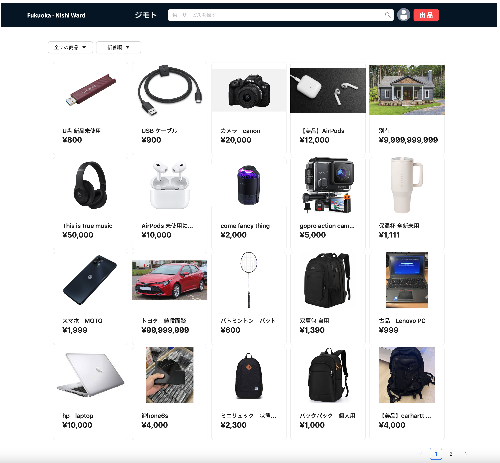

	

<h3 align=center>My Techs.</h3>

	

   

<h2>My Projects.</h2>
<h3>JIMOTO:</h3> JIMOTO is an website project for buying and selling things and services with local(jimoto in Japanese) people.

Here are the <a href = "https://github.com/lgangkai/jimoto-front">frontend<a/> using javascript and react, and <a href = "https://github.com/lgangkai/jimoto">backend<a/> using GoLang using microservice.

<!--
**lgangkai/lgangkai** is a ✨ _special_ ✨ repository because its `README.md` (this file) appears on your GitHub profile.

Here are some ideas to get you started:

- 🔭 I’m currently working on ...
- 🌱 I’m currently learning ...
- 👯 I’m looking to collaborate on ...
- 🤔 I’m looking for help with ...
- 💬 Ask me about ...
- 📫 How to reach me: ...
- 😄 Pronouns: ...
- ⚡ Fun fact: ...
-->
